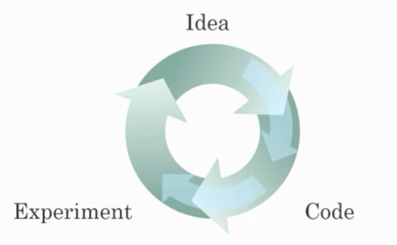

## Week 1 Quiz - Introduction to Deep Learning

1. Which of the following best describes the role of AI in the expression "an AI-powered society"?

    - [ ] AI controls the power grids for energy distribution, so all the power needed for industry and in daily life comes from AI.
    - [x] AI is an essential ingredient in realizing tasks, in industry and in personal life.
    - [ ] AI helps to create a more efficient way of producing energy to power industries and personal devices.

2. Which of the following are reasons that didn't allow Deep Learning to be developed during the '80s?

    - [ ] People were afraid of a machine rebellion.
    - [ ] The theoretical tools didn’t exist during the 80’s.
    - [X] Limited computational power.
    - [X] Interesting applications such as image recognition require large amounts of data that were not available.

3. When building a neural network to predict housing price from features like size, the number of bedrooms, zip code, and wealth, it is necessary to come up with other features in between input and output like family size and school quality. True/False?

    - [ ] True
    - [x] False

    Note: A neural network figures out by itself the "features" in between using the samples used to train it.

4. Features of animals, such as weight, height, and color, are used for classification between cats, dogs, or others. This is an example of "structured" data, because they are represented as arrays in a computer. True/False?

    - [X] True (Yes. The data can be represented by columns of data. This is an example of structured data, unlike images of the animal.)
    - [ ] False (No. The data can be represented by columns of data. This is an example of structured data, unlike images of the animal.)

5. Which of these are reasons for Deep Learning recently taking off? (Check the two options that apply.)

    - [ ] Neural Networks are a brand new field.
    - [x] We have access to a lot more computational power.
    - [x] We have access to a lot more data.
    - [x] Deep learning has resulted in significant improvements in important applications such as online advertising, speech recognition, and image recognition.

6. Recall the diagram of iterating over different ML ideas. Which of the stages shown in the diagram was improved with the use of a better GPU/CPU?
    
    - [x] Experiments finish faster, producing better ideas through increased iteration tempo.
    - [ ] Without better hardware, there is no way to train models faster.
    - [ ] With larger datasets, the iteration process is faster.
    - [X] Some algorithms are specifically designed to run experiments faster.

7. When an experienced deep learning engineer works on a new problem, they can usually use insight from previous problems to train a good model on the first try, without needing to iterate multiple times through different models. True/False?

    - [ ] True
    - [x] False

8. Images for cat recognition is an example of “structured” data, because it is represented as a structured array in a computer. True/False?

    - [ ] True
    - [x] False

9. A dataset is composed of age and weight data for several people. This dataset is an example of “structured” data because it is represented as an array in a computer. True/False?

    - [X] True
    - [ ] False

10. Why can an RNN (Recurrent Neural Network) be used to create English captions to French movies? Choose all that apply.

    - [x] It can be trained as a supervised learning problem.
    - [ ] RNNs are much more powerful than a Convolutional Neural Network (CNN).
    - [x] The RNN is applicable when the input and output of the problem are sequences.
    - [ ] The RNN requires a small number of examples.
 

11. From the given diagram, we can deduce that large NN models are alwaysbetter than traditional learning algorithms. True/False?

    - [ ] True
    - [x] False

12. Assuming the trends described in the previous question's figure are accurate (and hoping you got the axis labels right), which of the following are true? (Check all that apply.)

    - [x] Increasing the training set size generally does not hurt an algorithm’s performance, and it may help significantly.
    - [x] Increasing the size of a neural network generally does not hurt an algorithm’s performance, and it may help significantly.
    - [ ] Decreasing the training set size generally does not hurt an algorithm’s performance, and it may help significantly.
    - [ ] Decreasing the size of a neural network generally does not hurt an algorithm’s performance, and it may help significantly.
