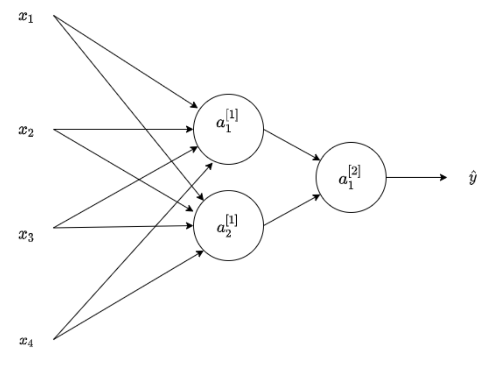
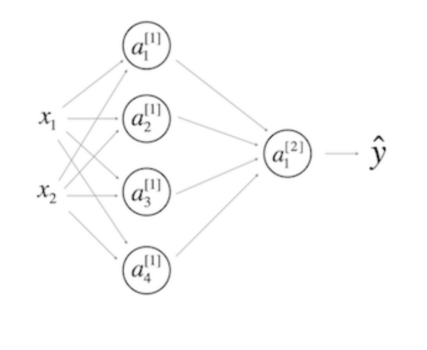

## Week 3 Quiz - Shallow Neural Networks

1. Which of the following are true? (Check all that apply.)

   - [x] $ w^{[4]}\_3 $ is the column vector of parameters of the fourth layer and third neuron.
   - [ ] $ w^{[4]}\_3 $ is the row vector of parameters of the fourth layer and third neuron.
   - [ ]$ w^{[4]}\_3 $ is the column vector of parameters of the third layer and fourth neuron.
   - [ ] $ w^{[1]} $ is a matrix with rows equal to the parameter vectors of the first layer.
   - [ ] $ w_1 $ is a matrix with rows equal to the parameter vectors of the first layer.
   - [ ] $ w^{[1]} $ is a matrix with rows equal to the transpose of the parameter vectors of the first layer.

2. The sigmoid function is only mentioned as an activation function for historical reasons. The tanh is always preferred without exceptions in all the layers of a Neural Network. True/False?

   - [x] False
   - [ ] True

   `Yes. Although the tanh almost always works better than the sigmoid function when used in hidden layers, thus is always proffered as activation function, the exception is for the output layer in classification problems.`

3. Which of these is a correct vectorized implementation of forward propagation for layer `l`, where $ 1<=l<=L $?

   $ Z^{[l]}=W^{[l]} A^{[l-1]} + b $

   $ A^{[l]}=g^{[l]}(Z^{[l]}) $

4. The use of the ReLU activation function is becoming more rare because the ReLU function has no derivative for c=0. True/False?

   - [x] False
   - [ ] True

5. Consider the two following code:

   ```
   x = np.random.rand(4, 5)
   y = np.sum(x, axis=1)
   c = a * b
   ```

   What will be y.shape?

   `(4,)`

6. Suppose you have built a neural network with one hidden layer and tanh as activation function for the hidden layers. Which of the following is a best option to initialize the weights?

   `Initialize the weights to small random numbers.`

7. Using linear activation functions in the hidden layers of a multilayer neural network is equivalent to using a single layer. True/False?

   - [x] True
   - [ ] False

   `When the identity or linear activation function g(c)=c is used the output of composition of layers is equivalent to the computations made by a single layer.`

8. You have built a network using the tanh activation for all the hidden units. You initialize the weights to relative large values, using np.random.randn(..,..)\*1000. What will happen?

   `This will cause the inputs of the tanh to also be very large, thus causing gradients to be close to zero. The optimization algorithm will thus become slow.`

9. Consider the following 1 hidden layer neural network:

   

   Which of the following statements are True? (Check all that apply).

   - [ ] $ w^{[1]} $ will have shape (4,2).
   - [x] $ b^{[1]} $ will have shape (2,1).
   - [ ] $ b^{[1]} $ will have shape (4,2).
   - [ ] $ W^{[2]} $ will have shape (2,1).
   - [x] $ W^{[2]} $ will have shape (1,2).
   - [x] $ W^{[1]} $ will have shape (2,4).

10. What are the dimensions of $ Z^{[1]} $ and $ A^{[1]} $ ?

    

    - [ ] $ Z^{[1]} $ and $ A^{[1]} $ are (4,2)
    - [ ] $ Z^{[1]} $ and $ A^{[1]} $ are (4,1)
    - [ ] $ Z^{[1]} $ and $ A^{[1]} $ are (1,4)
    - [x] $ Z^{[1]} $ and $ A^{[1]} $ are (4,m)
