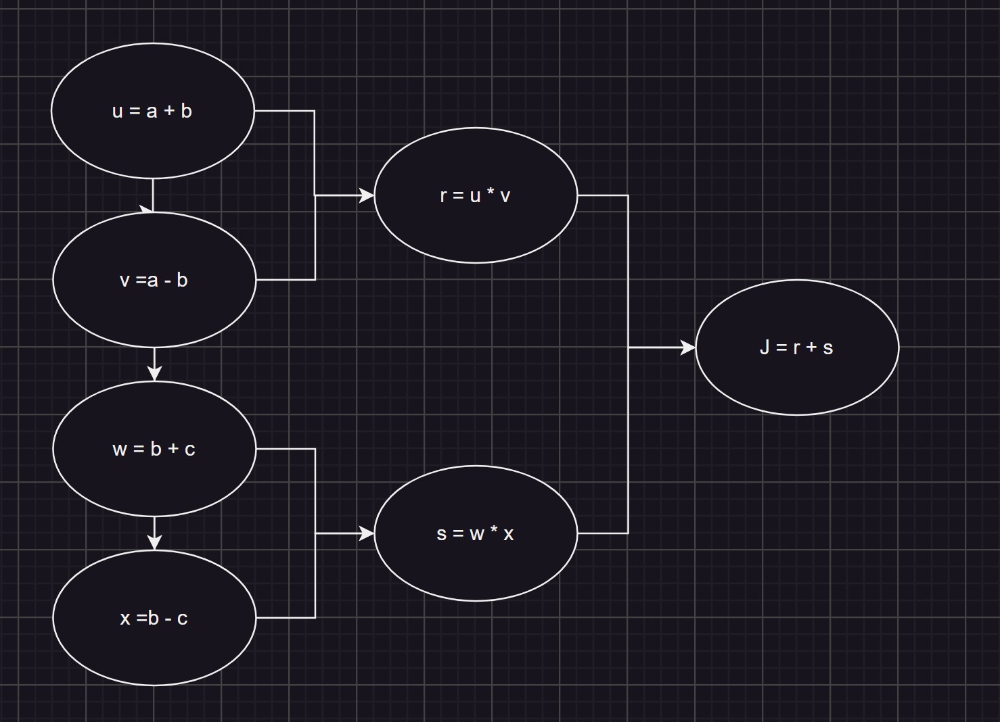

## Week 2 Quiz - Neural Network Basics

1. In logistic regression given `x` parameters $w ∈ R^{n_x}, b ∈ R$. Which of the following best expresses what we want `y^`​ to tell us?

   - [ ] $ P(y == \hat{y} \vert x) $
   - [ ] $ \sigma (Wx+b) $
   - [x] $ P(y == 1 \vert x) $
   - [ ] $ \sigma (Wx) $

2. Suppose that $\hat{y}$ == 9 and y == 1. What is the value of the "Logistic Loss"? Choose the best option.

   - [~] 0.005
   - [ ] $+\infty $
   - [ ] $L(\hat{y}, y) == (\hat{y} \space log \space y + (1 - \hat{y}) \space log(1-y))$
   - [~] 0.105

3. Suppose img is a (32,32,3) array, representing a 32x32 image with 3 color channels red,green and blue. How do you reshape this into a column vector `x`?

   `x = img.reshape((32*32*3, 1))`

4. Consider the two following random arrays `a` and `b`, and `c`:

   ```
   a = np.random.randn(2, 3) # a.shape = (2, 3)
   b = np.random.randn(2, 1) # b.shape = (2, 1)
   c = a + b
   ```

   What will be the shape of "c"?

   `c.shape = (2,3)`

5. Consider the two following random arrays `a` and `b`:

   ```
   a = np.random.randn(4, 3) # a.shape = (4, 3)
   b = np.random.randn(3, 2) # b.shape = (3, 2)
   c = a * b
   ```

   What is the shape of c?

   `The computation cannot happen because the sizes don't match. It is going to be "Error".
In numpy the "*" operator indicates element-wise multiplication. It is different from "np.dot()". If you would try "c = np.dot(a,b)" you would get c.shape = (4, 2).`

6. Suppose our input batch consists of 8 grayscale images, each of dimension 8x8. We reshape these images into feature column vectors $x^j$. Remember that $X=[x^{(1)}, x^{(2)} ... x^{(8)} ]$. What is the dimension of $X$?

   `(64,8)`

   `After converting the 8x8 gray scale images to a column vector we get a vector of size 64, thus X has dimension (64,8)`

7. Consider the two following array:

   ```
   a = np.array([[2,1],[1,3]])
   ```

   What is the result of $np.dot(a,a)$?

   `array([[ 5,  5],
   [ 5, 10]])`

8. Consider the two following code snippet:

   ```
   a.shape = (4, 3)
   b.shape = (4, 1)

   for i in range(3):
       for j in range(4):
           c[i][j] = a[j][i] + b[j]
   ```

   How do you vectorize this?

   `c = a.T + b.T`

9. Consider the two following arrays:

   ```
   a = np.array([[1,1],[1,-1]])
   b = np.array([[2],[3]])

   c = a + b
   ```

   Which of the following arrays is stored in `c`?

   `array([[ 3,  3],
   [ 4, 2]])`

10. Consider the following computational graph.

    

    What is the output of `J`?

    $J=r+s=u∗v+w∗x=(a+b)∗(a−b)+(b+c)∗(b−c)=a^2 −b^2 +b^2 −c^2 =a^2 −c^2$

    `Result is` $a^2 - c^2$

11. Consider the two following random arrays `a` and `b`:

    ```
    a = np.random.randn(1, 3) # a.shape = (4, 3)
    b = np.random.randn(3, 3) # b.shape = (3, 2)
    c = a * b
    ```

    What is the shape of c?

    `c.shape = (3, 3).`

12. Suppose you have $n_x$ input features per example. Recall that $X=[x^{(1)}, x^{(2)}...x^{(m)}]$. What is the dimension of X?

    $(n_x, m)$

13. Consider the two following code snippet:

    ```
    a.shape = (3, 4)
    b.shape = (4, 1)

    for i in range(3):
        for j in range(4):
            c[i][j] = a[i][j] + b[j]
    ```

    How do you vectorize this?

    `c = a * b.T`

14. Consider the two following code snippet:

    ```
    a.shape = (3, 3)
    b.shape = (3, 3)

    c == a**2 + b.T**2
    ```

    Which of the following gives an equivalent output for `c`?

    $for \space i \space in \space range(3): \newline
    \space\space\space for \space j \space in \space range(3): \newline
            \space\space\space\space\space\space c[i][j] = a[i][j]**2 + b[j][i]**2$
