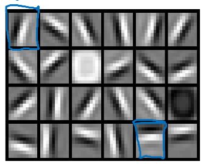
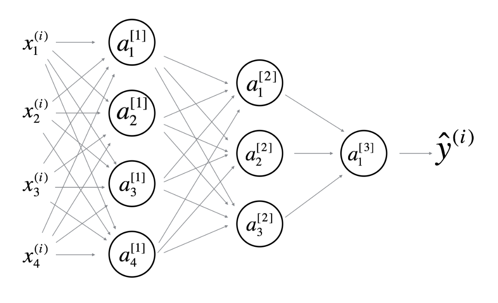

## Week 4 Quiz - Key Concepts on Deep Neural Networks

1. What is stored in the 'cache' during forward propagation for latter use in backward propagation?

   - [ ] $A^{[l]}$
   - [x] $Z^{[l]}$
   - [ ] $W^{[l]}$
   - [ ] $b^{[l]}$

   `In the equations for backward propagation we see that dA[l] and finally dW[l] depends on Z[l]`

2. Which of the following are “parameters” of a neural network? (Check all that apply.)

   - [ ] $g^{[l]}$ the activation functions.
   - [x] $b^{[l]}$ the bias vector.
   - [ ] $L$ the number of layers of the neural network.
   - [x] $W^{[l]}$ the weight matrices.

3. Which of the following is more likely related to the early layers of a deep neural network?

   

4. We can not use vectorization to calculate $dA^{[l]}$ in backpropagation, we must use a for loop over all the examples. True/False?

   - [x] False
   - [ ] True

5. Suppose W[i] is the array with the weights of the i-th layer, b[i] is the vector of biases of the i-th layer, and g is the activation function used in all layers. Which of the following calculates the forward propagation for the neural network with L layers.

   for i in range(1, L+1):
   Z[i]=W[i]\*A[i-1]+b[i]
   A[i]=g(Z[i])

6. Consider the following neural network:

   

   What are all the values of $n^{[0]}, n^{[1]}, n^{[2]}, n^{[3]}$ and $n^{[4]}$ ?

   `4,4,3,2,1`

7. During forward propagation, for the value of $A^{[l]}$ the value is used of $Z^{[l]}$ with the activation function $g^{[l]}$. During backward propagation we calculate $dA^{[l]}$ from $Z^{[l]}$

   - [x] False
   - [ ] True

   `During backward propagation we are interested in computing dW[l] and db[l]. For that we use g′L, dZ[l], Z[l], and W[l].`

8. There are certain functions with the following properties:

(i) To compute the function using a shallow network circuit, you will need a large network (where we measure size by the number of logic gates in the network), but (ii) To compute it using a deep network circuit, you need only an exponentially smaller network. True/False?

- [ ] False
- [x] True

9. Consider the following 2 hidden layer neural network:

   

   Which of the following statements are True? (Check all that apply).

   - [x] $W^{[3]}$ will have shape (1,3)
   - [x] $b^{[3]}$ will have shape (1,1)
   - [x] $b^{[2]}$ will have shape (3,1)
   - [x] $W^{[2]}$ will have shape (3,4)
   - [x] $b^{[1]}$ will have shape (4,1)
   - [x] $W^{[1]}$ will have shape (4,4)

10. In the general case if we are training with `m` examples what is the shape of $A^{[l]}$ ?

    $(n^{[l]},m)$

11. What is the "cache" used for in our implementation of forward propagation and backward propagation?

   - [ ] It is used to cache the intermediate values of the cost function during training.
   - [x] We use it to pass Z computed during forward propagation to the corresponding backward propagation step. It contains useful values for backward propagation to compute derivatives.
   - [ ] It is used to keep track of the hyperparameters that we are searching over, to speed up computation.
   - [ ] We use it to pass variables computed during backward propagation to the corresponding forward propagation step. It contains useful values for forward propagation to compute activations.

12. Considering the intermediate results below, which layers of a deep neural network are they likely to belong to?

    

    `Late layers of the deep neural network`

13. Assume we store the values for $n^{[l]}$ in an array called layer_dims, as follows: layer_dims=$[n_x, 4,3,2,1]$. So layer 1 has four hidden units, layer 2 has 3 hidden units, and so on. Which of the following for-loops will allow you to initialize the parameters for the model?

    for i in range(len(layer_dims)-1):
      parameter["W" + str(i+1)]=np.random.randn(layer_dims[i+1], layer_dims[i])* 0.01
      parameter["b" + str(i+1)]=np.random.randn(layer_dims[i+1]), 1)* 0.01

    `This iterates over 0, 1, 2, 3 and assigns to W[l] the shape (n[l], n[l-1]).`

14. During forward propagation, in the forward function for a layer `l` you need to know what is the activation function in a layer (sigmoid, tanh, ReLU, etc.). During backpropagation, the corresponding backward function also needs to know what is the activation function for layer `l`, since the gradient depends on it. True/False?

    - [ ] False
    - [X] True

15. A shallow neural network with a single hidden layer and 6 hidden units can compute any function that a neural network with 2 hidden layers and 6 hidden units can compute. True/False?

    - [ ] True
    - [X] False

    `There are functions you can compute with a "small" L-layer deep neural network that shallower networks require exponentially more hidden units to compute.`