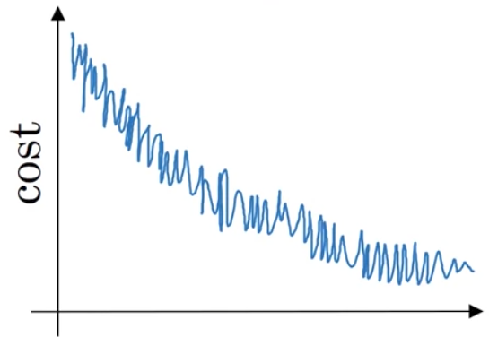

## Week 2 Quiz - Optimization Algorithms

1. Using the notation for mini-batch gradient descent. To what of the following does $a^{[2]{4}(3)}$ correspond?

   - The activation of second layer when the input is the third example of the fourth mini-batch.

 

2. Which of these statements about mini-batch gradient descent do you agree with?

   - When the mini-batch size is the same as the training size, mini-batch gradient descent is equivalent to batch gradient descent.

 

3. Which of the following is true about batch gradient descent?

   - It is the same as the mini-batch gradient descent when the mini-batch size is the same as the size of training set.

 

4. While using mini-batch gradient descent with a batch size larger than 1 but less than m, the plot of the cost function $J$ looks like this:

   

   You notice that the value of $J$ is not always decreasing. Which of the following is the most likely reason for that?

   - In mini-batch gradient descent we calculate $J(\hat{y}^{t}, y^t)$ thus with each batch we compute over a new set of data.

 

5. Which of the following is true about learning rate decay?

   - The intuition behind it is that for later epochs our parameters are closer to a minimum thus it is more convenient to take smaller steps to prevent large oscillations.

 

6. You use an exponentially weighted average on the London temperature dataset. You use the following to track the temperature: $v_t=βv_{t−1}+(1−β)θ_t$. The red line below was computed using $β=0.9$. What would happen to your red curve as you vary $β$? (Check the two that apply)

   

   - [ ] Decreasing $β$ will shift the red line slightly to the right
   - [x] Increasing $β$ will shift the red line slightly to the right
   - [x] Decreasing $β$ will create more oscillations within the red line
   - [ ] Increasing $β$will create more oscillations within the red line

7. Which of the following are true about gradient descent with momentum?

   - [ ] It decreases the learning rate as the number of epochs increases
   - [x] Increasing the hyperparameter $β$ smooths ut the process of gradient descent
   - [x] Gradient descent with momentum makes use of moving averages
   - [x] It generates faster learning by reducing the oscillation of the gradient descent process

 

8. Suppose batch gradient descent in a deep network is taking excessively long to find a value of the parameters that achieves a small value for the cost function $J(W^{[1]}, b^{[1]}, ...,W^{[L]},b^{[L]})$. Which of the following techniques could help find parameter values that attain a small value for $J$? (Check all that apply)

   - [ ] Try initializing all the weights to zero
   - [x] Try using Adam
   - [x] Try mini-batch gradient descent
   - [x] Normalize the input data

 

9. In very high dimensional spaces it is most likely that the gradient descent process gives us a local minimum than a saddle point of the cost function. True/False?

   - [ ] True
   - [x] False

 

10. While using mini-batch gradient descent with a batch size larger than 1 but less than m the plot of the cost function $J$ looks like this:

      

      Which of the following do you agree with?

      - No matter if using mini-batch gradient descent or batch gradient descent something is wrong

 

11. Suppose the temperature in Casablanca over the first two days of January are the same:

      Jan 1st: $\Theta_1=10^\degree C$

      Jan 2nd: $\Theta_2=10^\degree C$

      (We used Fahrenheit in the lecture, so we will use Celsius here in honor of the metric world.)

      Say you use an exponentially weighted average with $β=0.5$ to track the temperature: $v_0=0, v_t=βv_{t−1}+(1−β)θ_t$. If $v_2$ ​is the value computed after day 2 without bias correction, and $v_2^{corrected}$​ is the value you compute with bias correction. What are these values? (You might be able to do this without a calculator, but you don't actually need one. Remember what bias correction is doing.)

      - $v_2=7.5$, $v_2^{corrected}=10$

 

12. You use an exponentially weighted average on the London temperature dataset. You use the following to track the temperature: $v_t=βv_{t−1}+(1−β)θ_t$​. The yellow and red lines were computed using values $beta_1$ and $beta_2$ ​respectively. Which of the following are true?

   

   - $β_1 < β_2$

 

13. Consider the following:

      

      Suppose this plot was generated with gradient descent with momentum $β=0.01$. What happens if we increase the value of $β$ to 0.1 0.1?

      - The gradient descent process moves less in the horizontal direction and more in the vertical direction

 

14. Which of the following statements about Adam is **False**?

   - Adam should not used with batch gradient computations, not with mini-batches.

 

15. Why is the best mini-batch size usually not 1 and not m, but instead something in-between? Check all that are true.

   - [x] If the mini-batch size is 1, you lose the benefits of vectorization across examples in the mini-batch.
   - [ ] If the mini-batch size is 1, you end up having to process the entire training set before making any progress.
   - [ ] If the mini-batch size is m, you end up with stochastic gradient descent, which is usually slower than mini-batch gradient descent.
   - [x] If the mini-batch size is m, you end up with batch gradient descent, which has to process the whole training set before making progress.

 

16. Suppose the temperature in Casablanca over the first two days of January are the same:

      March 1st: $\Theta_1=10^\degree C$

      March 2nd: $\Theta_2=25^\degree C$

      Say you use an exponentially weighted average with $β=0.5$ to track the temperature: $v_0=0, v_t=βv_{t−1}+(1−β)θ_t$. If $v_2$ ​is the value computed after day 2 without bias correction, and $v_2^{corrected}$​ is the value you compute with bias correction. What are these values?

      - $v_2=15$, $v_2^{corrected}=20$

       
      <strong>Calculation steps:</strong>

      $v_1=(0.5*0)+(0.5*10)=5$

      $v_2=(0.5*5)+(0.5*25)=15$

      Using bias correction: $\frac{v_t}{1- β ^t}$ we get $\frac{15}{1-(0.5)^2}=20$

